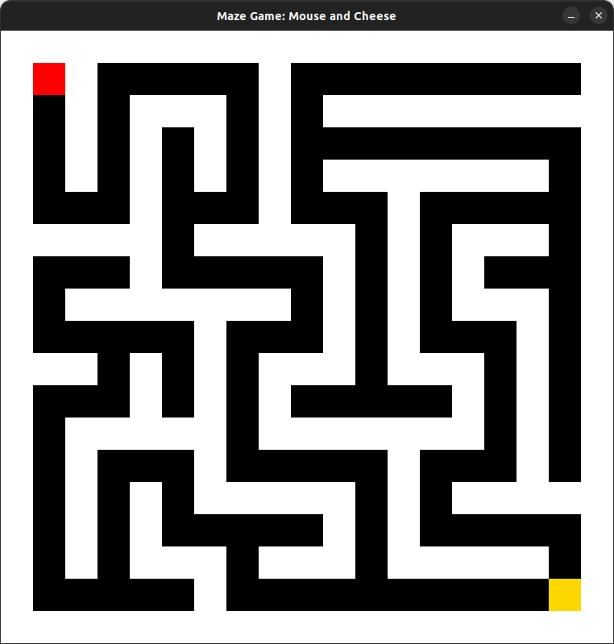

# Simple Maze Game

# 🧀 Maze Game: Mouse and Cheese 🐭

A Python-based maze game built with **pygame**, where a mouse navigates a procedurally generated perfect maze to collect cheese. The maze is generated deterministically using recursive backtracking and a predefined **seed**, ensuring a single path from start to goal. Players control the mouse using arrow keys, and upon reaching the cheese, a **"You Win!"** message is displayed.

## 🚀 Features

- ✅ **Procedural Maze Generation** – deterministic with a fixed seed
- ✅ **Smooth Keyboard Controls** – move with arrow keys
- ✅ **Perfect Maze Structure** – exactly one solution
- ✅ **Lightweight Pygame Visualization**

## 🎮 How to Play

1. Install dependencies (if not already installed):
   ```bash
   pip install pygame
   ```
2. Run the game:
   ```bash
   python maze_game.py
   ```
3. Use the **arrow keys** to guide the mouse (🔴) through the maze to reach the cheese (🧀).
4. Reach the cheese to win! 🎉

## 📸 Screenshot

**

## 🛠️ How It Works

- The **maze** is generated using **recursive backtracking** on a grid-based system.
- Walls are represented as `1`s and passage cells as `0`s.
- The **mouse always starts at the top-left corner (1,1)**, and the **cheese is at the bottom-right corner**.
- The game ensures **a single valid path exists** between start and goal.

## 📜 License

This project is open-source and available under the **MIT License**.

---

🐭 Built with ❤️ using **pygame**.
